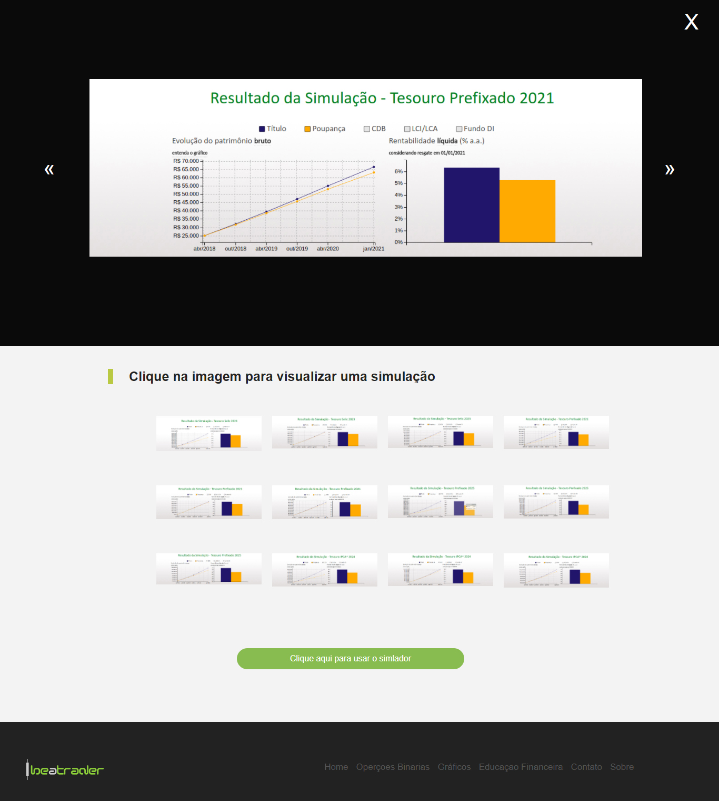

# Site-BeATrader
Trabalho da disciplina de Programação Web I do curso de Sistemas de Informação (Universidade Federal do Piauí) - Site sobre o mundo trader.

# Objetivo
O objetivo do site é fornercer alguns conhecimentos sobre o mundo de investimento

# Requisito do Trabalho
Desenvolver um site utilizando apenas HTML, CSS e Javascript. O site deve estar de acordo com os requisitos da W3C e passar no validador da W3C.
O site deve possuir um formulário de contato, uma galeria e uma página "sobre"

  
  

